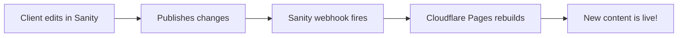

# Migrating to Cloudflare Pages with Auto-Deploy

This guide shows how to set up automatic deployments when Sanity content changes.

## 1. Create Cloudflare Pages Project

1. Go to [Cloudflare Dashboard](https://dash.cloudflare.com) → Pages
2. Click "Create a project"
3. Connect to Git provider (GitHub)
4. Select your repository: `www-cindy-coaching`
5. Configure build settings:
   - Build command: `npm run build`
   - Build output directory: `dist`
   - Root directory: `/` (leave blank)

## 2. Set Environment Variables in Cloudflare

In your Pages project settings → Environment variables:

```
PUBLIC_SANITY_PROJECT_ID = y67p94j5
```

## 3. Create Deploy Hook

1. In Cloudflare Pages project → Settings → Builds & deployments
2. Find "Deploy hooks" section
3. Click "Create deploy hook"
4. Name it: "Sanity Content Update"
5. Copy the webhook URL (looks like: `https://api.cloudflare.com/client/v4/pages/webhooks/deploy_hooks/xxx`)

## 4. Configure Sanity Webhook

1. Go to [Sanity Management](https://www.sanity.io/manage)
2. Select your project
3. Go to API → Webhooks
4. Click "Create webhook"
5. Configure:
   - Name: "Deploy to Cloudflare"
   - URL: [Paste your Cloudflare deploy hook URL]
   - Dataset: production
   - Trigger on: Create, Update, Delete
   - Filter: Leave empty (triggers on all document changes)
   - Secret: Leave empty (Cloudflare doesn't require it)
   - HTTP method: POST

## 5. How It Works



## Benefits

- ✅ Automatic deployment on content changes
- ✅ No manual deploy needed
- ✅ Git-based version control
- ✅ Preview deployments for branches
- ✅ Rollback capability
- ✅ Built-in CDN and caching

## Testing

1. Make a small change in Sanity Studio
2. Publish the change
3. Watch Cloudflare Pages dashboard - build should start automatically
4. Once complete, your site has the new content!

## Fallback: Manual Deploy

If automatic deploy fails, you can always:
- Push to GitHub to trigger a build
- Use the "Retry deployment" button in Cloudflare
- Trigger the webhook manually

## Monitoring

- Check webhook logs in Sanity: API → Webhooks → Your webhook → Logs
- Check build logs in Cloudflare Pages dashboard